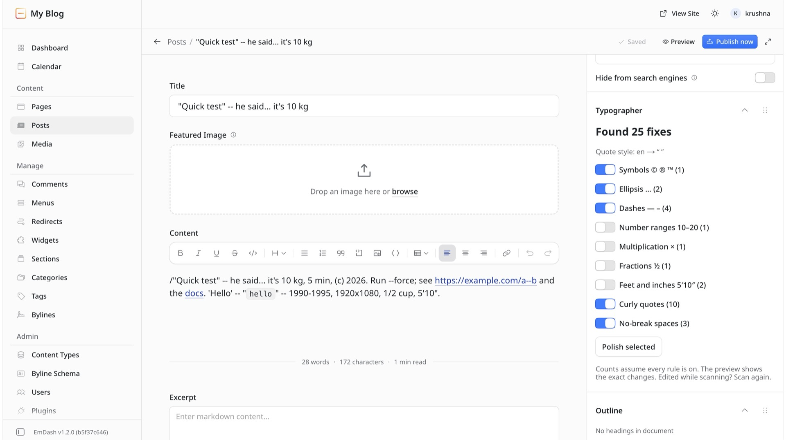
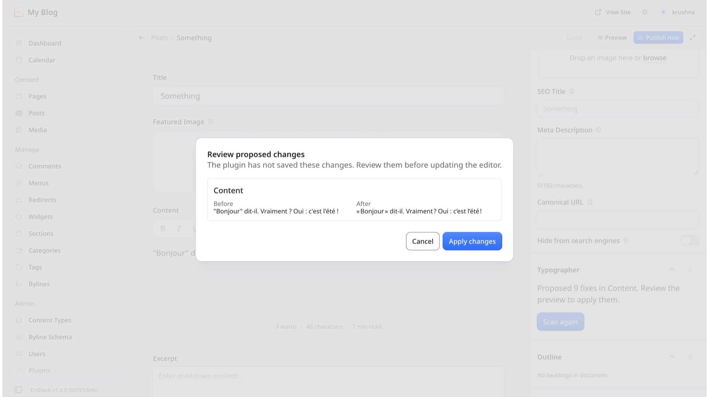

# Typographer

Finds typographic mistakes in the entry you are editing — straight quotes, `--`, `...`, breaking spaces in `10 kg` — and proposes fixes you preview before applying. Nothing changes without that preview.

## What it fixes

Rules run in this order.

| # | Rule | Default | Changes | Never touches |
|---|---|---|---|---|
| 1 | Spacing | on | 2+ spaces → 1 | intentional non-breaking spaces |
| 2 | Symbols | on | `(c)` `(r)` `(tm)` → `©` `®` `™` | `(c)` in a field that also has `(a)` or `(b)` |
| 3 | Ellipsis | on | `...` → `…` | `....` and longer |
| 4 | Dashes | on | `--` → `—`; ` - ` between words → ` – ` | `--flag` (also `"--flag"`, `(--flag)`), `---`, line-start hyphen |
| 5 | Ranges | off | `10-20`, `1990-1995` → en dash | `2026-10-08`, `555-123-4567`, `B-52`, first ≥ second (e.g. `3-2`, `5-5`) |
| 6 | Multiplication | off | `1920x1080`, `3 x 4` → `×` | `0x1F`, `X200x300` |
| 7 | Fractions | off | `1/2 1/4 3/4 1/3 2/3` → `½ ¼ ¾ ⅓ ⅔` | `1/2/2026`, `11/2`, `1/20` |
| 8 | Primes | off | `5'10"` → `5′10″`; `6' tall` → `6′ tall` | a closing quote after a number (`"I am 10"`) |
| 9 | Quotes | on | `"x"` → `“x”`, `it's` → `it’s`, `'90s` → `’90s`, `'tis` → `’tis` | already-curly quotes; a quote right after a number with no quote open (`12" pizza`, left for Primes) |
| 10 | Non-breaking spaces | on | `10 kg`, `₹ 500`, `5 €`; French: narrow NBSP before `; ! ?` and inside `« »`, NBSP before `:` | `12:30`, `:)` |

Never touched by any rule: inline `code` spans, code blocks, HTML blocks, URLs, emails, inline objects, images, embeds, tables, non-text fields.

## How to use

1. Open the **Typographer** panel in the editor sidebar.
2. Click **Scan draft**.
3. Toggle the rules you want. Counts show what each rule would change (all rules are counted, even the ones that are off).
4. Click **Polish selected**.
5. Review the preview the editor shows.
6. **Apply**, then **Save**.

If you edit the entry while working, the host rejects the result: scan again.

In EmDash 1.2, the rich-text editor may keep showing the old text after **Apply** even though the change was applied. Save and reload the page to see it; titles and plain-text fields update straight away.

## Settings

In the admin, open **Plugins** and click the gear (**Settings**) button on Typographer. EmDash builds this form from the plugin's settings schema; it needs the manage-plugins permission.

- **Rule defaults** — which rules are pre-selected in the panel. On by default: spacing, symbols, ellipsis, dashes, quotes, non-breaking spaces. Off by default: ranges, multiplication, fractions, primes.
- **Quote style** — `auto` (the entry's language, falling back to English) or a fixed language from the table below.

## Permissions

Exactly two, and nothing else:

- `admin.editor-draft:read` — read the entry you are editing.
- `admin.editor-draft:patch` — suggest changes to it (you preview and apply them).

No network access, no content access outside the editor, no hooks, no content storage — it only keeps its own settings.

## Limits

- The panel appears only on these collections (28): `posts`, `pages`, `projects`, `articles`, `news`, `blog`, `stories`, `docs`, `guides`, `tutorials`, `events`, `products`, `case_studies`, `portfolio`, `services`, `recipes`, `podcasts`, `episodes`, `faqs`, `testimonials`, `team`, `jobs`, `courses`, `lessons`, `changelog`, `press`, `resources`, `reviews`.
- It reads and fixes only these fields (19): `title`, `subtitle`, `headline`, `excerpt`, `summary`, `description`, `intro`, `lead`, `content`, `body`, `text`, `bio`, `abstract`, `caption`, `quote`, `question`, `answer`, `details`, `overview`.
- A never-saved (new) entry must be saved once before the panel can scan it.
- Very long fields can't be scanned at all: if any of these fields is over 64 KB (or all of them together over 192 KB), EmDash doesn't hand the entry to the plugin. If fixing a field would push it over 64 KB, the panel warns and leaves that field alone.
- Tables and custom blocks are not touched in v1.

The lists are fixed because EmDash plugin manifests cannot use wildcards.

## Languages

Quote style swaps glyphs only: what you typed as double becomes the language's double pair, single becomes its single pair.

| Language | Double | Single |
|---|---|---|
| en, nl, hi, gu, zh | “ ” | ‘ ’ |
| fr | « » | ‹ › |
| es, it, pt | « » | “ ” |
| ru | « » | „ “ |
| de | „ “ | ‚ ‘ |
| pl | „ ” | « » |
| ja | 「 」 | 『 』 |
| da | » « | › ‹ |

## Reporting a security issue

Use a [private security advisory](https://github.com/ravalkrushna1/emdash-typographer/security/advisories/new).

## License

MIT
